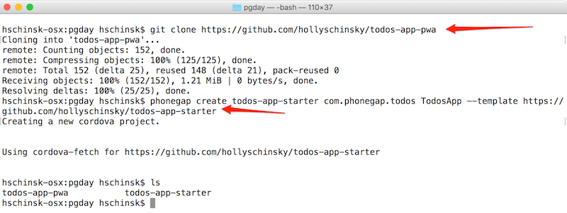

## Overview
This lesson assumes you have the PhoneGap CLI installed. If you have not installed it yet, you can do so now with the following command (requires node):

        npm install -g phonegap

>Alternatively, you could use the Cordova CLI or the PhoneGap Desktop app to create your new project.

## Exercise
1. Create a new folder on your desktop called **pgday** and navigate into it

        mkdir pgday
        cd pgday/

1. Get a copy of [the final app project](https://github.com/hollyschinsky/todos-app-pwa) by either cloning it into to your **pgday** folder with `git` or downloading the zip. You can use this project for reference throughout the workshop.

2. Next, from the command line (and within the **pgday** folder), create a new app project with the CLI using an existing GitHub repo as the template (_todos-app-starter_ is the path, _com.phonegap.todos_ is the fully qualified package name and _TodosApp_ is the app name that will be shown on the device. Modify these as you wish):

   ```
   phonegap create todos-app-starter com.phonegap.todos TodosApp --template https://github.com/hollyschinsky/todos-app-starter
   ```

   or with Cordova...

   ```
   phonegap create todos-app-starter --id com.phonegap.todos --name TodosApp --template https://github.com/hollyschinsky/todos-app-starter
   ```

   

   >If you only have the Desktop app you can still use it to create a new project and just select the blank template. You will need to download or clone the [todos-app-starter](https://github.com/hollyschinsky/pwa-workshop-starter) app first and then replace the `www` folder and `config.xml` in your newly project with those from the **todos-app-starter** repo.

3. You should now have a **pgday** folder with the two projects below:

         ../pgday
         ../pgday/todos-app-starter
         ../pgday/todos-app-pwa


4. Try it out! `cd` into the **todos-app-starter** and type `phonegap serve`, then use your Chrome browser to navigate to the URL returned. You can open the developer tools with the Option+Command+I combination or via the **View -> Developer** option from the menu and run it in the mobile emulator tools to see how it looks on different devices. You will need to reload the page if switching between an android or ios device to pick up the other style sheet.

 


   >If you're using Cordova you will need to add the `browser` platform first (`cordova platform add browser`), then run `cordova serve` and open `http://localhost:8000/browser/` in the browser. If you are using PhoneGap Desktop, hit the green _play_ icon to start the server and then navigate to the URL shown in the bottom status bar.

   >**Tip:** The Vue developer tools Chrome extension is useful for debugging your apps built with this app stack in the future, and require the non-minified version of vue. This is not required for this workshop. 

<div class="row" style="margin-top:40px;">
<div class="col-sm-12">
<a href="index.html" class="btn btn-default"><i class="glyphicon glyphicon-chevron-left"></i> Previous</a>
<a href="lesson2.html" class="btn btn-default pull-right">Next <i class="glyphicon
glyphicon-chevron-right"></i></a>
</div>
</div>
