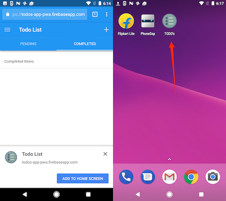

## Overview
The [manifest file](https://w3c.github.io/manifest/) is a JSON formatted file used to describe your app and how it should appear when it's installed to the home screen. This includes properties like the app name, icons and attributes about how it should be launched when the icon is clicked.

## Exercise 

1. `cd` into the **www** folder of the **todos-app-starter** project and create a new file with the name **manifest.json**.

2. Paste in the the following definition:

            {
            "manifest_version": 2,  
            "name": "Todo List", 
            "version": "1.0.0",
            "short_name": "TODO's", 
            "icons": [{
                "src": "img/icons/icon-128x128.png",
                "sizes": "128x128",
                "type": "image/png"
                }, {
                "src": "img/icons/icon-144x144.png",
                "sizes": "144x144",
                "type": "image/png"
                }, {
                "src": "img/icons/icon-152x152.png",
                "sizes": "152x152",
                "type": "image/png"
                }, {
                "src": "img/icons/icon-192x192.png",
                "sizes": "192x192",
                "type": "image/png"
                }, {
                "src": "img/icons/icon-256x256.png",
                "sizes": "256x256",
                "type": "image/png"
                }],
            "start_url": "/index.html",
            "display": "standalone",
            "background_color": "#2196F3",
            "theme_color": "#2196F3"
            }

   >You can also set an `orientation` property if desired, default is `portrait`.

3. Next you need to tell your app to use this new manifest file. Open the **www/index.html** file and add a link to it anywhere before the closing HTML `</head>` tag:

        <link rel="manifest" href="manifest.json">

4. If you're still serving the app from the previous lesson, simply refresh your browser, otherwise run `phonegap serve` again and re-open the URL. Next open the dev tools and click on the **Application** tab in the top, and the **manifest** tab on the left as shown below to ensure your manifest file was found:

 

  >You can test out the **Add to homescreen** feature from the browser like above to test out the start URL setting your app start URL is invoked properly for a quick test but otherwise will need to try out the app using your Android device and a hosted app URL to see how the changes apply.

## Device Testing
There's a hosted version of this app located at [https://todos-app-pwa.firebaseapp.com](https://todos-app-pwa.firebaseapp.com) for you to try out from an Android device browser to see how the manifest settings affect the app overall. The screenshots below show it running on an Android Pixel:

<!---->

## Resources
- [W3C Manifest Spec](https://w3c.github.io/manifest/)
- [The Web App Manifest](https://developers.google.com/web/fundamentals/web-app-manifest/)
- [AndroidAssetStudio](https://romannurik.github.io/AndroidAssetStudio/) - helps you create your icons for different resolutions for Android.
- [Debugging Progressive Web Apps](https://developers.google.com/web/tools/chrome-devtools/progressive-web-apps)

<a href="lesson1.html" class="btn btn-default"><i class="glyphicon glyphicon-chevron-left"></i> Previous</a>
<a href="lesson3.html" class="btn btn-default pull-right">Next <i class="glyphicon
glyphicon-chevron-right"></i></a>

