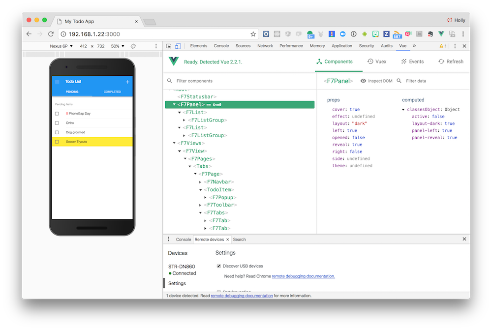

## Overview
The manifest file is a JSON formatted file used to describe your app and how it should appear when it's installed to the home screen. This includes properties like the name, icons etc. It also controls how it should be launched when that icon is clicked (start URL, display and orientation).

## Exercise 

1. `cd` into the `www` folder of the **todos-app-starter** project create a new file and name it **manifest.json**.

2. Paste in the the following definition:

            {
            "manifest_version": 2,
            "name": "Todo List",
            "version": "1.0.0",
            "short_name": "TODO's",
            "icons": [{
                "src": "img/icons/icon-128x128.png",
                "sizes": "128x128",
                "type": "image/png"
                }, {
                "src": "img/icons/icon-144x144.png",
                "sizes": "144x144",
                "type": "image/png"
                }, {
                "src": "img/icons/icon-152x152.png",
                "sizes": "152x152",
                "type": "image/png"
                }, {
                "src": "img/icons/icon-192x192.png",
                "sizes": "192x192",
                "type": "image/png"
                }, {
                "src": "img/icons/icon-256x256.png",
                "sizes": "256x256",
                "type": "image/png"
                }],
            "start_url": "/index.html",
            "display": "standalone",
            "background_color": "#3E4EB8",
            "theme_color": "#2F3BA2"
            }

  > You can also set an `orientation` property if desired, try it out by adding `"orientation": "landscape"` after the `theme_color`.

3. The app needs to be aware of this new manifest file to apply it. Open your **index.html** file and add a link to it anywhere before the closing HTML `</head>` tag.

    <link rel="manifest" href="manifest.json">

4. If you're still serving the app from the previous lesson, refresh your browser and click on the dev tools **Application** tab in the top and manifest tab on the left as shown below to ensure it's been applied:

<a href="lesson1.html" class="btn btn-default"><i class="glyphicon glyphicon-chevron-left"></i> Previous</a>
<a href="lesson3.html" class="btn btn-default pull-right">Next <i class="glyphicon
glyphicon-chevron-right"></i></a>

