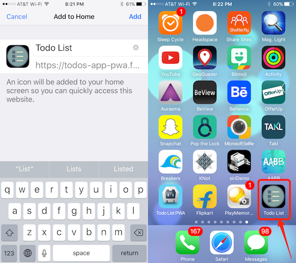

## Overview
Developers should always consider any progressive enhancements that could be added to enhance the user experience across browser platforms.

In this lesson we'll learn about some HTML elements we can add to our apps to provide progressive enhancements for iOS and Windows.

In your **todos-app-starter** app, open the **www/index.html** file and go through the following exercies.

### iOS Web App Customizations
- Add the `apple-mobile-web-app-capable` meta tag to your app to run in **standalone** (aka fullscreen) mode when launched from the home screen:

    `<meta name="apple-mobile-web-app-capable" content="yes">`

  >This setting removes all of the browser chrome around your app, including the URL text field and bottom button bar. Only the status bar will be displayed. Check out [this article](https://medium.com/@firt/dont-use-ios-web-app-meta-tag-irresponsibly-in-your-progressive-web-apps-85d70f4438cb) for specific UX considerations.

- Set the status bar color to use when the app is launched from the home screen:

    `<meta name="apple-mobile-web-app-status-bar-style" content="black">`

   >There are three options to choose from: `default`, `black`, and `black-translucent`. The most compatibility is black; default and black-translucent behave differently between iOS 6 and 7. (Sometimes on iOS 7+, the status bar starts as white-on-white or black-on-black and requires a restart of the app to fix it).

- Set the title to display for your app when it's added to the home screen:

    `<meta name="apple-mobile-web-app-title" content="Todo List">`

   >If you don't specify this tag, iOS will use the `<title>` tag. If that is missing too, it will default to “Favorites”. Also note that the title is limited to 8 to 12 characters.    

- Set the icon to use when the app is added to the home screen:

    `<link rel="apple-touch-icon" href="img/icons/apple-touch-icon.png">`
 
  >By default, the icon is a screenshot of the page. If there are no icon tags, Safari will try various URLs depending on the device. You should check out the [Apple docs](https://developer.apple.com/library/content/documentation/AppleApplications/Reference/SafariWebContent/ConfiguringWebApplications/ConfiguringWebApplications.html) specifically  for for how to set different sizes and resolutions for your icons.

- Set the startup image to launch when your app is launched from the home screen with the following tag:

    `<link rel="apple-touch-startup-image" href="img/Default-Portrait.png"> `

  >You should check out the [Apple docs](https://developer.apple.com/library/content/documentation/AppleApplications/Reference/SafariWebContent/ConfiguringWebApplications/ConfiguringWebApplications.html) specifically  for for how to set different sizes and resolutions for your launch images.

### iOS Screenshots
  The screenshot below shows how these settings affects the app when you choose to add it to your homescreen on iOS:

   

### Microsoft Windows Web App Customizations

- Set the tile image to use when the app is pinned to the home screen:

        <meta name="msapplication-TileImage" content="img/icons/mstile-150x150.png">

- Set a color for the tile to use when the app is pinned to the home screen:

        <meta name="msapplication-TileColor" content="#2F3BA2">

  > See the [Microsoft Pinned site metadata reference](https://msdn.microsoft.com/en-us/library/dn255024(v=vs.85).aspx) for more details.

## Resources
- [Don’t use iOS meta tags irresponsibly in your Progressive Web Apps](https://medium.com/@firt/dont-use-ios-web-app-meta-tag-irresponsibly-in-your-progressive-web-apps-85d70f4438cb)
- [iOS Configuring Web Apps Guide](https://developer.apple.com/library/content/documentation/AppleApplications/Reference/SafariWebContent/ConfiguringWebApplications/ConfiguringWebApplications.html).
- [A collection of HTML head elements](https://www.w3resource.com/slides/head.php)
- [Microsoft Pinned Site Enhancements](https://msdn.microsoft.com/en-us/library/bg183312(v=vs.85).aspx#)

<a href="lesson2.html" class="btn btn-default"><i class="glyphicon glyphicon-chevron-left"></i> Previous</a>
<a href="lesson4.html" class="btn btn-default pull-right">Next <i class="glyphicon
glyphicon-chevron-right"></i></a>

