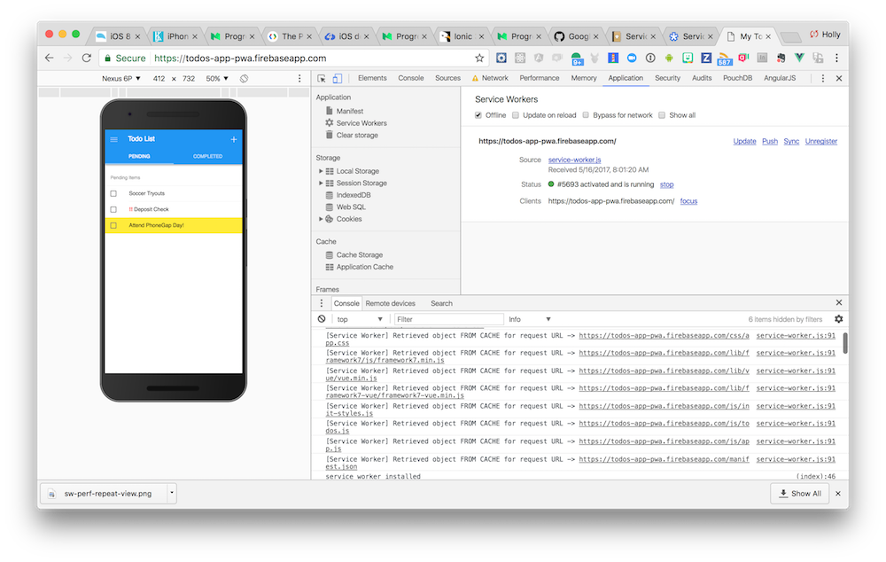
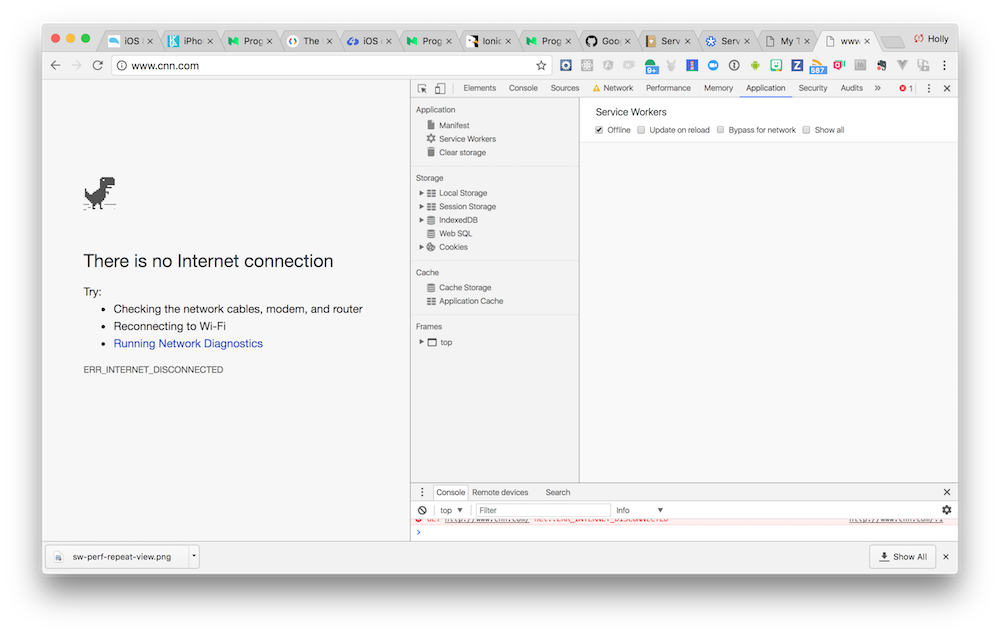
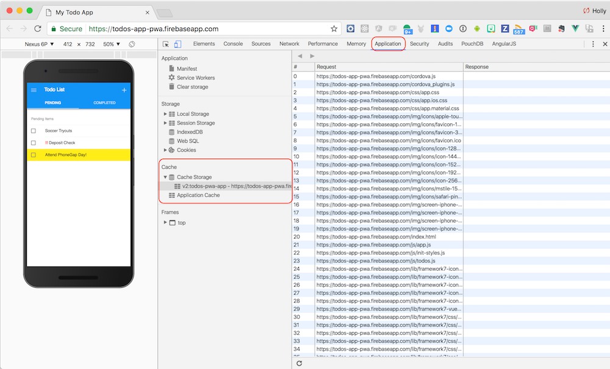

## Overview
A popular pattern for service workers is to use them to cache the app shell or dependent assets required to make the app functional so when the app is offline it will still load. This aproach also helps with performance since the app will load more quickly each time it's run. When a resource needs to be fetched, the service worker will try to load it from the cache first, then fall back to the network.

## Exercise

1. Remove the code inside the **service-worker.js** that we added in the last exercise, we are going to do a new pattern in this exercise.

2. Paste in the following code:

        // use a cacheName for cache versioning
        var cacheName = 'todos_offline_cache:v1'
        var goodCaches = [];
        goodCaches.push(cacheName);

        // during the install phase you usually want to cache static assets
        self.addEventListener('install', function(e) {
            console.log('[ServiceWorker] Install!!');
            e.waitUntil(
                caches.open(cacheName).then(function(cache) {
                    return cache.addAll([
                        // If we don't add the root, we must navigatee to http://localhost:3000/index.html when offline
                        '/',  
                        '/index.html',
                        '/manifest.json',
                        '/css/app.css',
                        '/css/app.ios.css',
                        '/css/app.material.css',
                        '/js/app.js',
                        '/js/todos.js',
                        '/js/init-styles.js',
                        '/cordova.js',
                        '/cordova_plugins.js',
                        '/plugins/cordova-plugin-statusbar/www/statusbar.js',
                        '/plugins/cordova-plugin-statusbar/src/browser/StatusBarProxy.js',
                        '/lib/framework7/css/framework7.ios.colors.min.css',
                        '/lib/framework7/css/framework7.ios.min.css',
                        '/lib/framework7/css/framework7.ios.rtl.min.css',
                        '/lib/framework7/css/framework7.material.colors.min.css',
                        '/lib/framework7/css/framework7.material.min.css',
                        '/lib/framework7/css/framework7.material.rtl.min.css',
                        '/lib/framework7/js/framework7.min.js',
                        '/css/framework7-icons.css',
                        '/css/Framework7Icons-Regular.eot',
                        '/css/Framework7Icons-Regular.ttf',
                        '/css/Framework7Icons-Regular.woff',
                        '/css/Framework7Icons-Regular.woff2',
                        '/lib/framework7-vue/framework7-vue.min.js',
                        '/lib/vue/vue.min.js',
                        '/img/Default-Portrait.png',
                        '/img/logo.png',
                        '/img/icons/apple-touch-icon.png',
                        '/img/icons/mstile-150x150.png',
                        '/img/icons/safari-pinned-tab.svg',
                        '/img/icons/favicon-16x16.png',
                        '/img/icons/favicon-32x32.png',
                        '/img/icons/favicon.ico',
                        '/img/icons/icon-128x128.png',
                        '/img/icons/icon-144x144.png',
                        '/img/icons/icon-152x152.png',
                        '/img/icons/icon-192x192.png',
                        '/img/icons/icon-256x256.png',
                    ]).then(function() {
                        self.skipWaiting();
                    });
                })
            );
        });

        self.addEventListener('activate', function(event) {
        console.log('[ServiceWorker] Activate');
        event.waitUntil(
                caches.keys().then(function(cacheNames) {
                    return Promise.all(
                        cacheNames.map(function(cacheKey) {
                            console.log("Cache key " + cacheKey);
                            if (goodCaches.indexOf(cacheKey) === -1) {
                                console.log("Deleting cache " + cacheKey);
                                return caches.delete(cacheKey);
                            }
                        })
                    );
                })
            );
        });

        self.addEventListener('fetch', function(event) {
        console.log('Handling fetch event for ' + event.request.url);
            event.respondWith(
                caches.match(event.request).then(function(response) {
                    if (response) {
                        console.log('Found response in cache:', response);
                        return response;
                    }
                    console.log('No response found in cache. Fetch from network...');
                    return fetch(event.request);
                })
            );
        });

3. Comment out the `` tag in **index.html** that we used for testing in the last exercise, you won't need that here.

4. Now run the application again using `phonegap serve`

### Verify New Service Worker
1. Go to the **Application** tab and click on the `service-worker` to see what code is running, and make sure there are no install errors or `skipWaiting()` events. 
2. You should see console statements from the code added above.
3. In the Application tab, you can take a look at the CacheStorage to see if your new cache is available and what's in it.
4. You should no longer see the image loading if you commented out in this lesson.

  >Your service worker code may fail if you have a typo, or if your resource list in the install step does not resolve to the right path, then the promise will not resolve and install will not complete. To test if that's the problem, comment out that whole block from `caches.open(cacheName).then(function(cache) {return cache.addAll([...])` on and run again. 

### Test Offline
The **Application** tab has an option to simulate an offline event to see how it will still run when you go offline due to the cached resources but if you navigate to another site like CNN, you will get the dreaded dinosaur:

  
  

   >You will want to try this hosted somewhere to get the true effect. You can host your site securely using github pages or a solution like Firebase (see lesson 7). Or simply check out the [hosted demo here](https://hollyschinsky.github.io/todos-app-pwa) for how the offline handling works.

You can also view the **Cache Storage** items that the service worker has stored in the **Application** tab as shown in the screenshot below:

  

  >You will sometimes need to refresh to see the latest cache, right click on **Cache Storage** to do so. 

### Service Worker Reminders
- Only one service worker will manage your app at any time, even if you have multiple browser tabs open. 
- You should always check the **Application** tab to see what the state of your `service-worker.js` is. You may be able to click to have it `skipWaiting` or `unregister` if needed. 
- You may want to keep **Update on reload** checked while in dev't. 

### CacheStorage Note
- Notice the `activate` event has handling to delete old versions of caches that are left around. There's a quota of storage that needs to be managed so you will want to be sure to clean up old versions when a new service worker no longer needs it. 

## Resources
- [Service Workers Explained](https://github.com/w3c/ServiceWorker/blob/master/explainer.md)
- [Service Worker Lifecycle](https://developers.google.com/web/fundamentals/instant-and-offline/service-worker/lifecycle)
- [Is Service Worker Ready?](https://jakearchibald.github.io/isserviceworkerready/)
- [sw-precache](https://github.com/GoogleChrome/sw-precache) - popular project to help generate your service worker based on certain settings. Integrates with your build process.

<a href="lesson4.html" class="btn btn-default"><i class="glyphicon glyphicon-chevron-left"></i> Previous</a>
<a href="lesson6.html" class="btn btn-default pull-right">Next <i class="glyphicon
glyphicon-chevron-right"></i></a>

