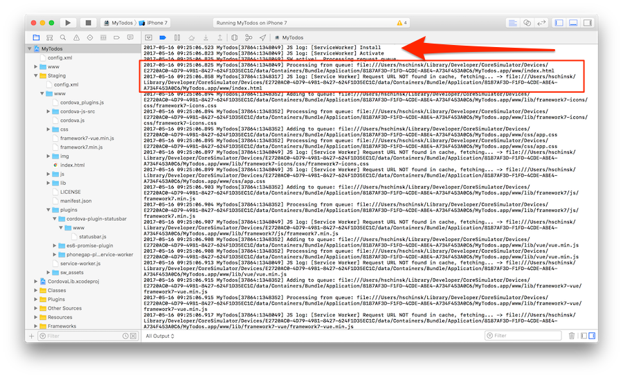
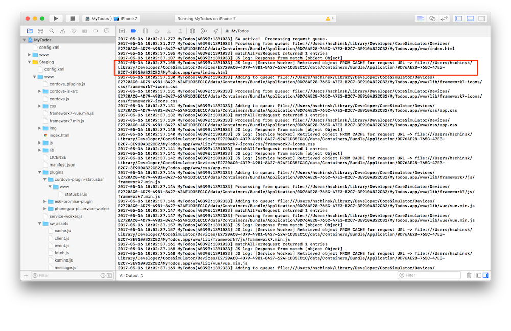
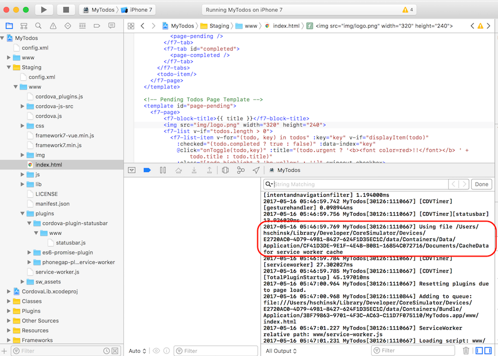
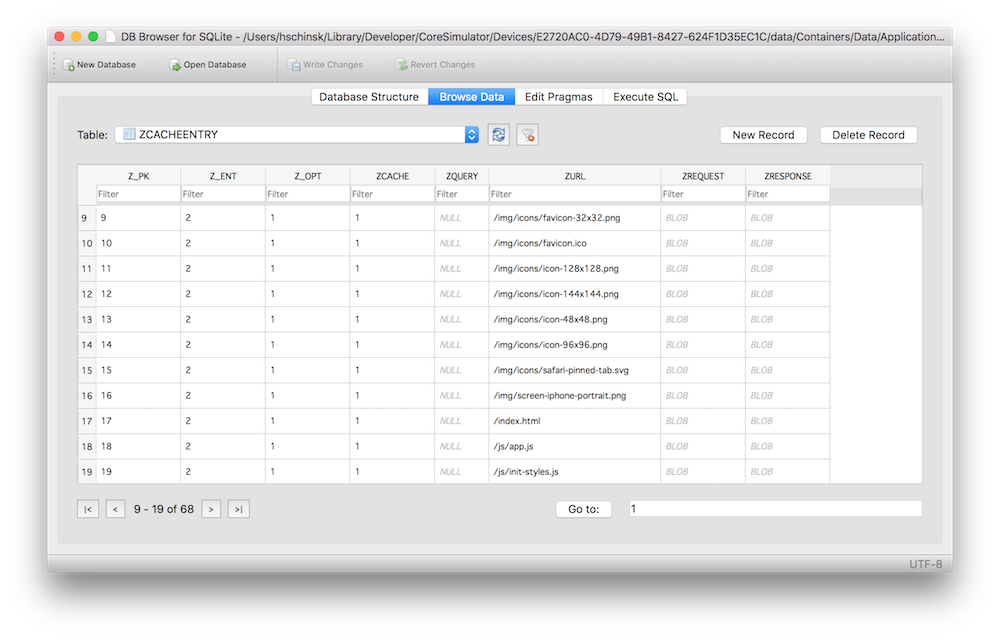

## Overview
It's a well-known fact that Apple currently does not support service workers on iOS. There's nothing much we can do about this for the browser side of things, however we can do something to add support to our PhoneGap app. There's a plugin available to polyfill the service worker support on iOS called [phonegap-plugin-service-worker](https://github.com/phonegap/phonegap-plugin-service-worker)

> This plugin was originally built by the [Mobile Chrome Apps team](https://github.com/MobileChromeApps) and subsequently forked by the PhoneGap team to help developers have more options when building with PhoneGap.

## Exercise

1. Add the [phonegap service worker plugin](https://github.com/phonegap/phonegap-plugin-service-worker) with the following command:

    `phonegap plugin add https://github.com/phonegap/phonegap-plugin-service-worker`

   > If you're using a recent version of the PhoneGap CLI, this plugin will automatically be saved to your config.xml. If you are running an older version you can add the `--save` to the command to ensure that it's saved.

2. Open your **config.xml** and look to ensure you see the plugin tag added like below:

      `<plugin name="phonegap-plugin-service-worker" spec="https://github.com/phonegap/phonegap-plugin-service-worker" />`

3. There are a couple of preferences that are used by the plugin and you will also need to add these into your **config.xml** file.

    - the `ServiceWorker` preference - you need to set this to the filename of the Service Worker JS code to be used when the app is run on iOS
    
    - the `CacheCordovaAssets` preference - a flag to tell the plugin if you want your Cordova app assets cached when it is first run. The **default is `true`**. Set this to `false` if you do not want your app assets cached.

    Open **config.xml** and add these two preferences with your desired values (or leave off the 2nd if you do want the assets to be cached):

        <preference name="ServiceWorker" value="service-worker.js" />
        <preference name="CacheCordovaAssets" value="false" />

   > The value of the ServiceWorker preference should match the service worker file you created previously in the `www` folder. DO NOT include the `www` in the file path as it is assumed to be located there by the plugin.

4. Now build the app for iOS with:

    `phonegap build ios`

5. Next open the **my-proj.xcodeproject** file created in the **~/pgday/todos-app-starter/platforms/ios/** folder in Xcode. For instance, if you named your project **todos-app-starter** then it will be named **todos-app-starter.xcodeproject**. 

6. Run the app from Xcode and watch the console for the service worker generated statements which indicate if a file was fetched or retrieved from the cache. 

Subsequent runs should show the files fetched from the cache.

>You may need to update a version when switching between service worker updates and cache names. The cache name is `CordovaAssets` when that preference is set to `true`. If you create
another cache name, this may not work right. 

### iOS Cache Data
The service-worker writes to a SQLite data store on iOS and the `phonegap-service-worker-plugin` actually logs the location in the Xcode console if you want to take a look at it:

You can download the [DB Browser for SQLite](http://sqlitebrowser.org/) tool to view the data cached by your app. Simply find the location of the cache data in the Xcode console and open the `swcache.db` file:

Then browse the data with the DB Browser:

### Network Intercept Test
Now let's try out that same service worker code we tested from the PWA version of the app to intercept a network fetch call. Uncomment that piece of code in the **service-worker.js** located in the **Staging** folder under `www` and run the app again. You'll also need to uncomment the `` tag we added into `index.html`. 

<a href="lesson4.html" class="btn btn-default"><i class="glyphicon glyphicon-chevron-left"></i> Previous</a>
<a href="lesson6.html" class="btn btn-default pull-right">Next <i class="glyphicon
glyphicon-chevron-right"></i></a>

