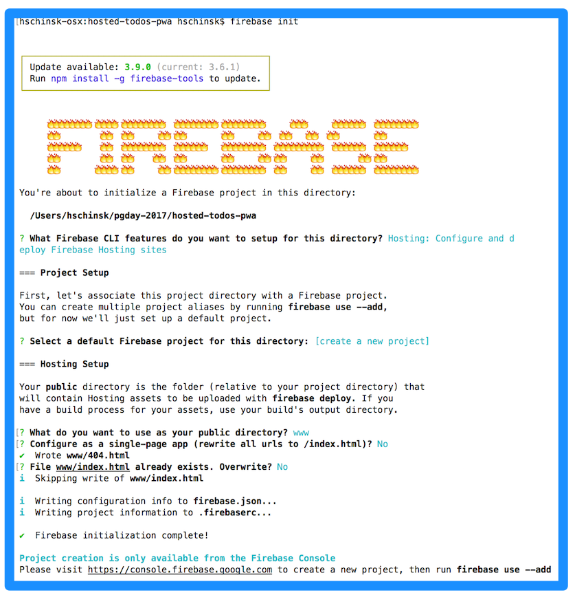
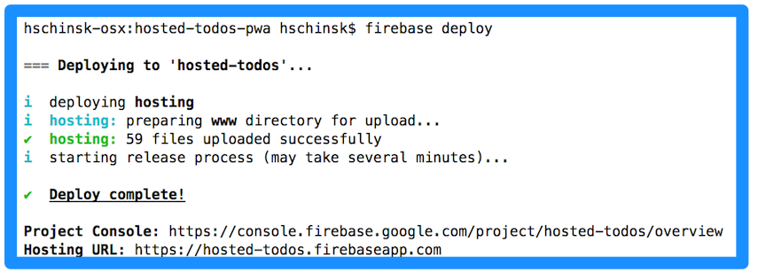

## Overview
You will want to find a place to host your apps securely. One easy option for starters is Firebase and they offer a free tier that allows you to host up to 5 apps. 

### Exercise 

1. Create a [Firebase](http://firebase.google.com) account if you don't have one already. 

2. Create a new project in Firebase via https://console.firebase.google.com (click the + Add project button).

3. Install the `firebase-tools` package. This gives you access to the Firebase CLI to use for easily deploying your apps for hosting. 

    `npm install -g firebase-tools`

4. Login to Firebase from the command line
    
    `firebase login`

5. Run the `init` command from the root of the project you want to host (ie: **~/pgday/todos-app-starter/**).
    
      `firebase init`

6. Next the Firebase tools will prompt you will the following questions: 

    - What Firebase CLI features do you want to setup for this folder? **Hosting: Configure and deploy Firebase Hosting sites** - _NOTE:_ You will likely want to deselect the other options as they're all selected initially. Hit the space bar to unselect.

     - What Firebase project do you want to associate as default? **&lt;project name you just created in the Firebase Console&gt;**

     - What do you want to use as your public directory? **www**

     - Configure as a single-page app (rewrite all urls to /index.html)? **y**
    
     - File www/index.html already exists. Overwrite? (y/N) **N**
    
       _You have just configured your firebase hosting project. In the process you will see that there are few files being added firebase.json, .firebaserc and database.rules.json. We will need to customize firebase.json but will do that later._

   An example of creating a project is shown below:

   

7. Deploy the site

      `firebase deploy`

   Note the URL of the hosted app in the output below:

   

6. You can add settings to **firebase.json** to control things like caching. This file was added into your root project and you can add some extra mappings like below to this file to ensure the service-worker.js file itself is not cached by firebase::

        "headers": [
          {
            "source": "service-worker.js",
            "headers": [
              {
                "key": "Cache-Control",
                "value": "max-age=0"
              }
            ]
          },

>See the [Firebase hosting and deploying documentation](https://firebase.google.com/docs/hosting/deploying) for more details. 

<a href="lesson7.html" class="btn btn-default"><i class="glyphicon glyphicon-chevron-left"></i> Previous</a>

